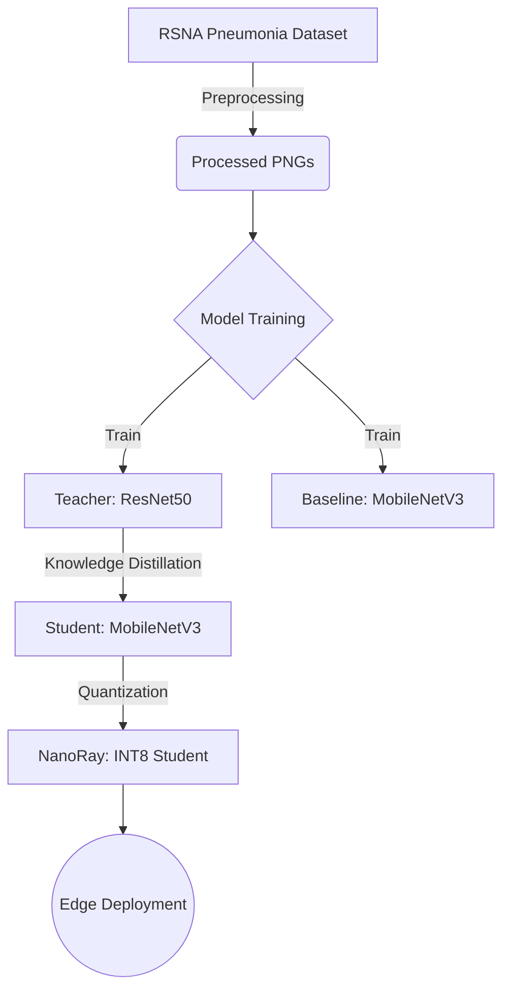

# NanoRay: Efficient Edge AI for Pneumonia Detection 🩻⚡


**NanoRay** is a lightweight, high-performance deep learning model designed for pneumonia detection on edge devices. By leveraging **Knowledge Distillation** and **Dynamic Quantization**, this project successfully compresses a massive ResNet50 model into a tiny 3.6 MB MobileNetV3, achieving **higher accuracy** than the original teacher model.

## 🚀 Key Results: The "Student > Teacher" Phenomenon

On the rigorous **RSNA Pneumonia Detection Dataset**, the distilled student model outperformed the teacher, proving that distillation acts as an effective regularizer.

| Model | Role | Size | Accuracy | Latency (CPU) |
| :--- | :--- | :--- | :--- | :--- |
| **ResNet50** | Teacher | 89.9 MB | 83.18% | ~15.3 ms |
| **MobileNetV3** | Baseline | 5.8 MB | 83.10% | ~3.5 ms |
| **NanoRay** | **Distilled Student** | **5.8 MB** | **84.15%** 🏆 | **~3.7 ms** |
| **NanoRay (INT8)** | **Quantized** | **3.6 MB** 📉 | **84.15%** | **~12.8 ms** |

> **Highlight:** The final NanoRay model is **25x smaller** than the teacher and **~1.0% more accurate**, making it ideal for mobile/IoT deployment without sacrificing diagnostic reliability.

## 🧠 Methodology

### Architecture Diagram



1. **Teacher-Student Architecture:**
    * Teacher: ResNet50 (Pretrained on ImageNet). High capacity, coverage, but computationally expensive.
    * Student: MobileNetV3-Small. Designed for efficiency and speed.
2. **Knowledge Distillation:**
    * Used Response-Based Distillation (Hinton et al.).
    * Loss Function: Combination of `KLDivLoss` (Soft Targets) and `CrossEntropy` (Hard Labels).
    * Temperature ($T$): 4.0
3.  **Post-Training Quantization:**
    *   Applied Dynamic INT8 Quantization to weights and activations to reduce model size from 5.8 MB to 3.6 MB.

## 📂 Project Structure

The project uses a flat structure for simplicity and direct access to notebooks.

```bash
├── data/
│   ├── processed_pngs/      # Converted RSNA images (generated)
│   ├── stage_2_train.csv    # Original labels
│   └── *_split.csv          # Train/Val/Test splits (generated)
├── 01_Data_Prep.ipynb            # DICOM to PNG conversion & Data Splitting
├── 02_train_teacher.ipynb        # Training ResNet50 Teacher Model
├── 03_train_baseline.ipynb       # Training MobileNetV3 Baseline (No Distillation)
├── 04_train_student_distillation.ipynb # Knowledge Distillation Training (Core Logic)
├── 05_metric_and_comparison.ipynb   # Latency & Accuracy Analysis / Comparisons
├── teacher_resnet50.pth          # Saved Teacher Weights
├── baseline_mobilenet.pth        # Saved Baseline Weights
├── nanoray_student.pth           # Saved Distilled Student Weights
├── requirements.txt              # Project dependencies
└── README.md                     # Project Documentation
```

## 🛠️ Installation & Usage

### 1. Clone the repository

```bash
git clone https://github.com/yourusername/NanoRay.git
cd NanoRay
```

### 2. Install dependencies

It is recommended to use a virtual environment (e.g., `venv` or `conda`).

```bash
pip install -r requirements.txt
```

*Note: You may need to install `pytorch` specifically for your CUDA version if you plan to train on GPU. See [pytorch.org](https://pytorch.org).*

### 3. Run the Pipeline

Follow the notebooks in numerical order:

1. **Data Prep**: Download the RSNA Pneumonia Detection Challenge dataset and place it in a `data/` folder (or update paths). Run `01_Data_Prep.ipynb` to convert DICOMs to PNGs and split the data.
2. **Train Models**:
    * Run `02_train_teacher.ipynb` to train the high-capacity teacher.
    * Run `03_train_baseline.ipynb` to train the baseline MobileNetV3 for comparison.
3. **Distillation**: Run `04_train_student_distillation.ipynb` to perform Knowledge Distillation from the Teacher to the Student.
4. **Evaluation**: Run `05_metric_and_comparison.ipynb` to generate metrics, plots, and perform quantization.

## 🔮 Future Work

* [ ] APP: Deploying the model via a FastAPI backend.
* [ ] APP: Building a React Native mobile app for offline inference.
* [ ] MODEL: Experimenting with Vit-Tiny (Vision Transformers) as a student architecture.

## 👨‍💻 Author

### Kabir Thayani (Jingg)

* Aspiring AI Engineer | Computer Vision Enthusiast
* [LinkedIn](https://www.linkedin.com/in/thayanikabir/) | [Email](mailto:thayanikabir.official@gmail.com)

---

*If you find this project useful, please give it a ⭐!*
